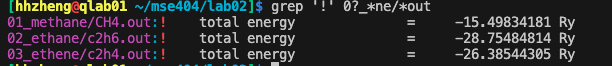

Lab 2: Quantum Espresso Input and Output for Molecules

## 目标
- 能量计算
1. 比较01_metahne与01a_metahne的区别
2. Methane甲烷, ethane乙烷 and ethene乙烯
3. C<sub>20</sub> 同分异构体

## 内容
各个样例的计算方法与结果比较可以直接运行 `bash run.sh`

## 样例介绍
### case1 比较01_metahne与01a_metahne的区别
```bash
cd ~/MSE404/lab02
module load gcc mkl espresso
pw.x < CH4.in &> CH4.out
```
输出文件：

- `pwscf.xml` 系统和计算结果的详细信息
-  `pwscf.save` xml文件的副本，以及hdf5文件记录了wavefunction, charge density, pseudoptential,作为进一步计算的输入文件
- `CH4.out` 结果分析详见lab01

**结果：** 两个文件夹的样例等价，ibrav=0表示自定义，两者的输入文件等价，输出结果total energy相同。

### case2 : Methane甲烷, ethane乙烷 and ethene乙烯
---------------------------


total energy:



三者除分子数和坐标不同，其余都相同，输入文件参考文件夹01_x, 02_x, 03_x.

case 3 : C<sub>20</sub> 同分异构体
----------------------


- 运行
  [`C20_bowl.in`](04_c20_bowl/C20_bowl.in), [`C20_ring.in`](05_c20_ring/C20_ring.in)
  and [`C20_cage.in`](06_c20_cage/C20_cage.in). Which one has the lowest total energy?


3者能量相近。
- todo ry转换成ev

- 运行非晶体结构
  [`C20_amorphous.in`](07_c20_amorphous/C20_amorphous.in). How does the energy
  compare to the previous isomers? Is it what you expected?

非晶体能量最高。

- 构造不稳定结构
  [`C20_smile.in`](08_c20_smile/C20_smile.in) 

   

能量是最高的。
从上面说明，可以通过分子结构看出哪种更稳定。

不稳定的结构无法收敛，使用错误的单位也无法收敛。


## 反馈学习&问题记录


