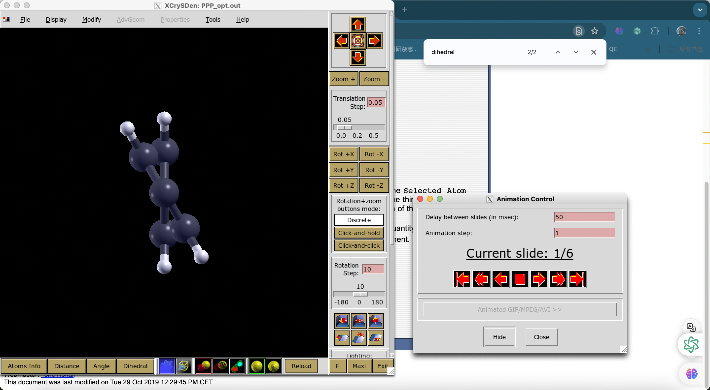
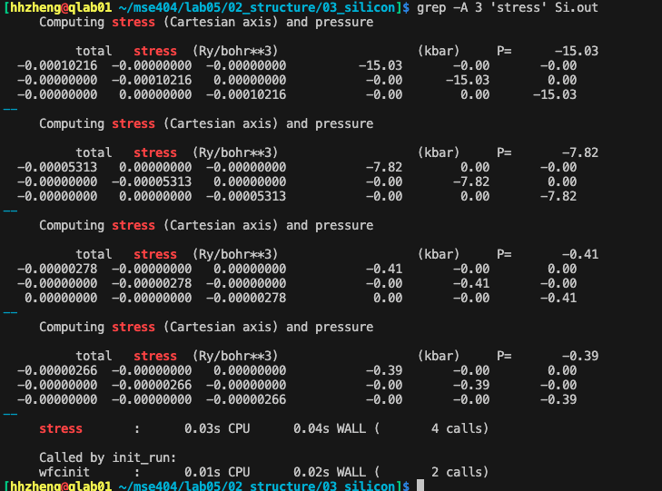

Lab03: 弛豫计算
===============================

## 目标
- 以phene为例，计算弛豫

- 以聚合物为例,计算弛豫,绘图

## 内容
运行`bash run.sh`


## 结果分析
在量子Espresso（QE）中，`vc` 或 `vc-relax` 是一种计算类型，表示变胞（variable-cell）弛豫计算。在这种计算中，系统的原子位置和晶胞参数都会被优化，以找到能量最低的结构。这种计算通常用于预测材料的稳定晶体结构或研究压力对材料性质的影响。

在输入文件中，你可以通过在 `&CONTROL` 部分设置 `calculation = 'vc-relax'` 来启用变胞弛豫计算。同时，你还需要在 `&CELL` 部分设置适当的参数，如晶胞弛豫的方法（`cell_dynamics`）和压力公差（`press_conv_thr`）。


Optimizing Ionic Positions - PPP
--------------------------------
# 弛豫计算， 优化离子位置

```bash
./auto_run.sh
```
xcrysden绘图

```bash
xcrysden --pwi file.in
xcrysden --pwo file.out
```



### _Task_
- 找到最佳角度（能量最低）。查看e_v_theta.txt


**TODO**
绘图方法需要进一步理解。plot_ppp.gp, ppp.eps.

- animation 展示，6帧.

  

  **ToDo**

 `dihedral angle` 弛豫的结果分析。


gher energy-cut off to converge the stress 

2. 设置 variable-cell relaxation by setting
`calculation = 'vc-relax'` in the `CONTROL` section. We must additionally
specify both an `IONS` section as previously, along with a `CELL` section.



### _Task_

晶格参数：

开始：


结束：


## 反馈学习&问题记录
Done.
