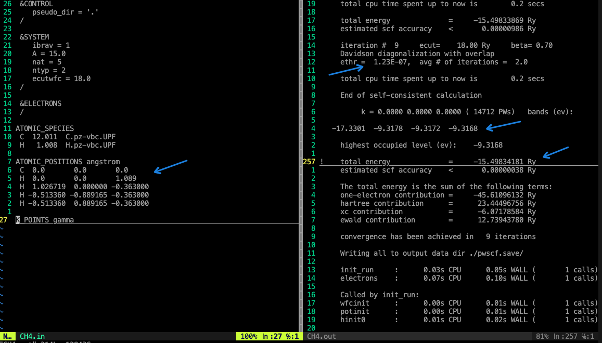

Lab01: methane 计算
===============================

## 目标
- 以methane为例，计算total energy
- 配置输入文件 methane
- 了解输出文件
- 输出文件分析

## 内容
运行`bash run.sh`

## 结果分析

- 根据methane表达式，有4个键，每个K点有4个值，价带差：-9.3162-(-17.3301) = 8.0139 (ev) ,与实验中的值12.50 (ev)相比偏小。
- total energy = 15.49834181 Ry
- ethr的阈值为1e-6,在iteration # 9时， ethr = 1.23e-7 ，end of self-consistent calculation.

## 反馈学习&问题记录
Done.