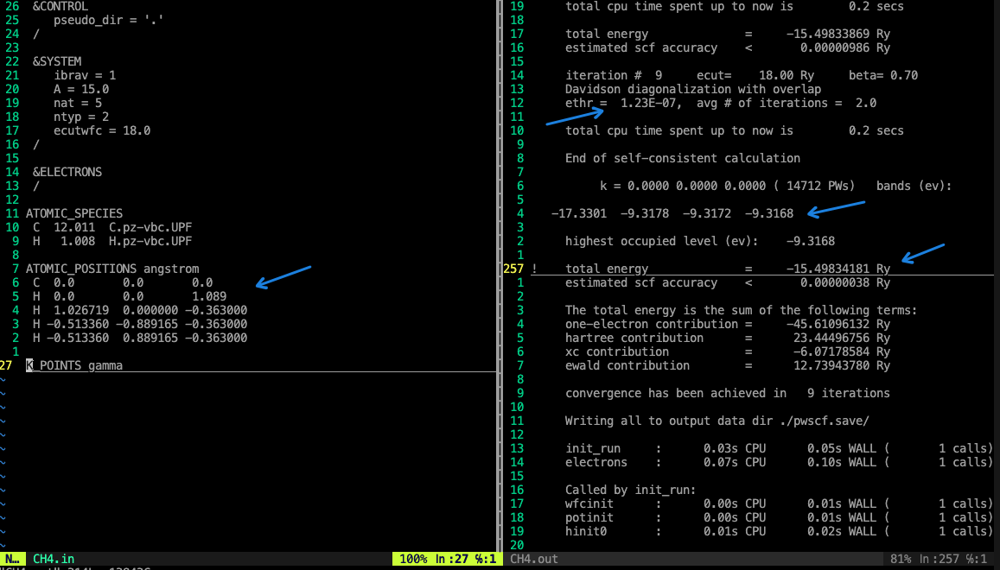

Lab01: methane 计算
===============================

## 目标
- 以methane为例，熟悉pw.x的计算
- 配置输入文件 methane
- 了解输出文件
- 输出文件分析

## 内容

To run the DFT example in this lab you will need to do the following:

- Make a directory that will hold the material for the MSE404 labs:
  `mkdir ~/MSE404`.
- Copy the directory with the inputs for this lab to this directory:
  `cp -r /opt/Courses/MSE404/lab01 ~/MSE404`.
- Copy the directory with the various pseudopotential files to this directory
  also: `cp -r /opt/Courses/MSE404/pseudo ~/MSE404`.
- Load the modules needed to run Quantum Espresso:
  `module load gcc mkl espresso`.
- Go to the directory with the input files you copied and use these with
  `pw.x` saving the output in a file:
  `cd ~/MSE404/lab01/methane; pw.x < CH4.in > CH4.out`.
- Take a look through the output file:
  `less CH4.out`.
- Logout of the remote server once you're done.

## 结果分析

- 根据methane表达式，有4个键，每个K点有4个值，价带差：-9.3162-(-17.3301) = 8.0139 (ev) ,与实验中的值12.50 (ev)相比偏小。
- total energy = 15.49834181 Ry
- ethr的阈值为1e-6,在iteration # 9时， ethr = 1.23e-7 ，end of self-consistent calculation.

## 反馈学习&问题记录
Done.