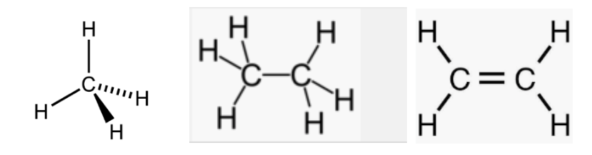
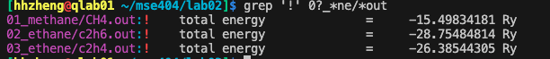
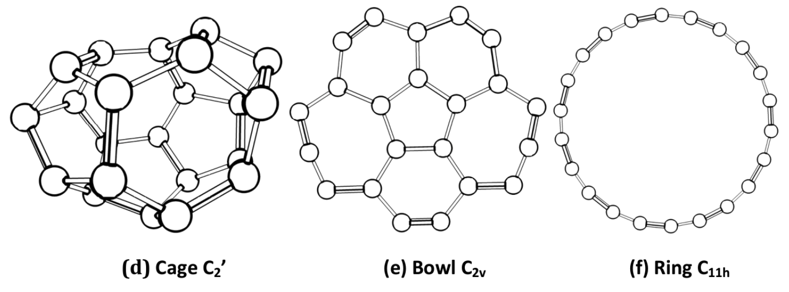
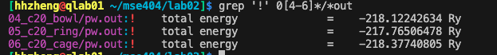
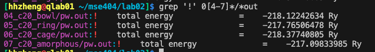
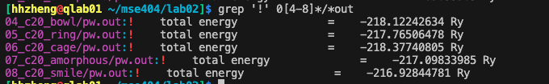

Lab 2: Quantum Espresso Input and Output for Molecules

## 反馈学习&问题记录
## 结果分析
======================================================

## 目标

## 内容
### case1 比较01_metahne与01a_metahne的区别
```bash
cd ~/MSE404/lab02
module load gcc mkl espresso
pw.x < CH4.in &> CH4.out
```
输出文件：

- `pwscf.xml` 系统和计算结果的详细信息
-  `pwscf.save` xml文件的副本，以及hdf5文件记录了wavefunction, charge density, pseudoptential,作为进一步计算的输入文件
- `CH4.out` 结果分析详见lab01

**结果：** 两个文件夹的样例等价，ibrav=0表示自定义，两者的输入文件等价，输出结果total energy相同。

### case2 : Methane甲烷, ethane乙烷 and ethene乙烯
---------------------------


total energy:



三者除分子数和坐标不同，其余都相同，输入文件参考文件夹01_x, 02_x, 03_x.

case 3 : C<sub>20</sub> 同分异构体
----------------------


### _Task_

- 运行
  [`C20_bowl.in`](04_c20_bowl/C20_bowl.in), [`C20_ring.in`](05_c20_ring/C20_ring.in)
  and [`C20_cage.in`](06_c20_cage/C20_cage.in). Which one has the lowest total energy?


3者能量相近。
- todo ry转换成ev

- 运行非晶体结构
  [`C20_amorphous.in`](07_c20_amorphous/C20_amorphous.in). How does the energy
  compare to the previous isomers? Is it what you expected?

非晶体能量最高。

- Finally, let's see what happens if we try something less realistic. In 
  [`C20_smile.in`](08_c20_smile/C20_smile.in) there is an input file for a structure
  which resembles a smiley face. Run this calculation and compare the energies.


能量是最高的。
从上面说明，同分异构体的能量相近，不能说明哪种更稳定，可以通过分子结构看出哪种更稳定。

不稳定的结构无法收敛，使用错误的单位也无法收敛。


Visualizing Structures
----------------------

There are many different tools that can be used to visualize atomic
structures. `xcrysden` is installed as a module on the server you're using for
this course, and conveniently can read Quantum Espresso input files. Try
loading the module with `module load xcrysden`, running the command `xcrysden`
and opening the input files for the various structures we've looked at in this
lab. You can do this by selecting `Open PWscf` on the file menu. Note that
since we are viewing a molecule, xcrysden will open a menu asking whether to
reduce the dimensionality. Select `reduce dimension to 0D`. 
There are many options to control how the structure looks, and you can
grab and rotate the structure with your mouse.

### _Task_

- See if you can figure out how to save an image of each C<sub>20</sub> isomer
  as a png file.

We can also use `xcrysden` to visualize other quantities, such as the charge
density. If you've got time left in this lab, check out the additional material
on [`visualization`](../visualising_output), which shows you
how to visualize the charge density of methane.

-------------------------------------------------------------------------------

Summary
-------

- 查看 Methane, ethane and ethene 输入文件的区别
-同分异构体之间能量区别 C<sub>20</sub>.

-------------------------------------------------------------------------------

Extra - Other molecules
-----------------------

In this course we give you the coordinates of the materials that you need to 
simulate. But what if you want to try something different? For molecules,
[Avogadro](https://avogadro.cc/) is a useful for progam for visualizing
and generating structures for a range of molecules. The online documentation
will show you how to build different molecules. Once you are happy, you can 
save the coordinates as a `.xyz` file, which will write the atomic positions
in Angstrom. You can then insert these coordinates into a Quantum Espresso
input file.

### _Optional Task_

- Try building a (small) molecule of your choice in Avogadro. For now, just use
  carbon and hydrogen - we'll look at what we need to do to use different elements
  next week. Once you've built a molecule, use it to make a Quantum Espresso input
  file and run the calculation.


